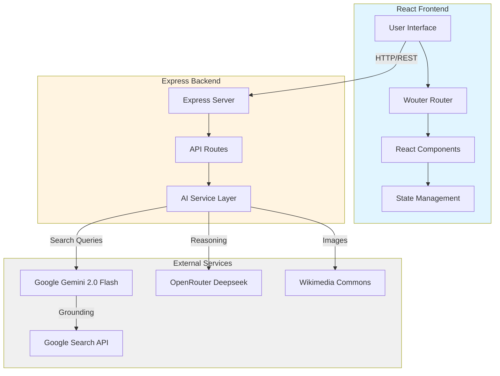
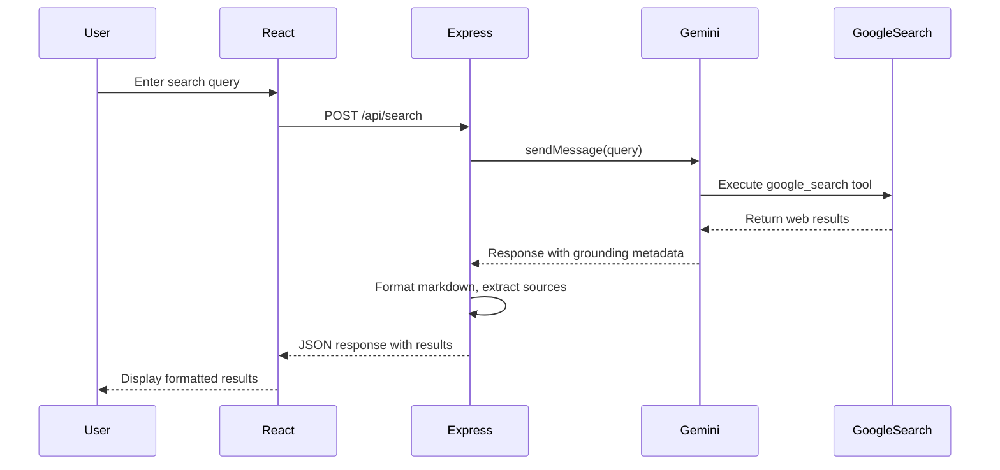
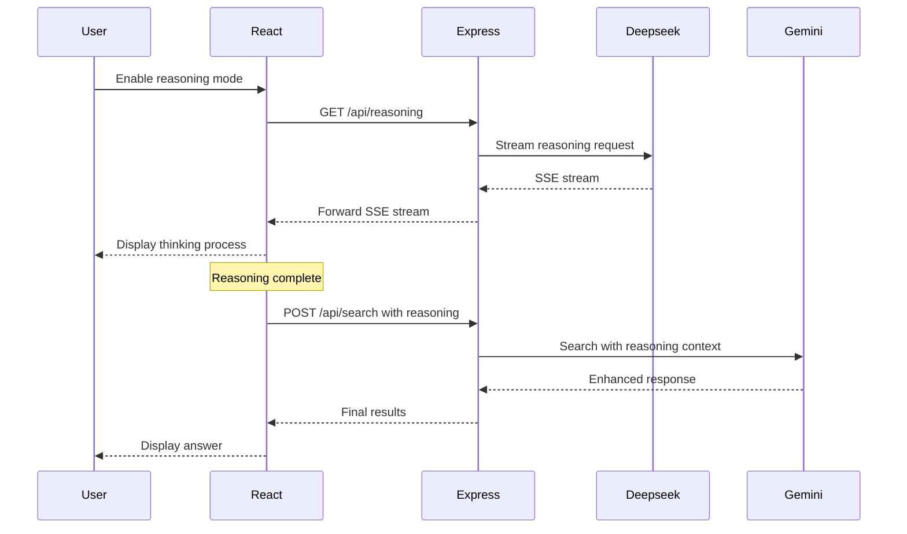

## Overview

OmniSearches is built as a modern full-stack application using React for the frontend and Express.js for the backend. The application leverages Google's Gemini 2.0 Flash API for AI-powered search with real-time grounding capabilities.

## System Architecture



## Project Structure

The codebase is organized into distinct client and server directories:

```
~/workspace/source/
├── client/                    # Frontend React application
│   ├── src/
│   │   ├── components/       # React components
│   │   │   ├── ui/          # shadcn/ui components
│   │   │   ├── SearchInput.tsx
│   │   │   ├── SearchResults.tsx
│   │   │   ├── ImageGallery.tsx
│   │   │   └── ...
│   │   ├── pages/           # Route pages
│   │   │   ├── Home.tsx
│   │   │   └── Search.tsx
│   │   ├── lib/             # Utilities
│   │   │   ├── prompts.ts
│   │   │   ├── queryClient.ts
│   │   │   └── utils.ts
│   │   ├── store/           # State management (Zustand)
│   │   │   ├── imageStore.ts
│   │   │   └── reviewImageStore.ts
│   │   ├── contexts/        # React contexts
│   │   │   └── LanguageContext.tsx
│   │   ├── hooks/           # Custom hooks
│   │   ├── i18n/            # Internationalization
│   │   ├── App.tsx          # Main app component
│   │   └── main.tsx         # Entry point
│   ├── public/              # Static assets
│   │   ├── locales/         # Translation files
│   │   └── ...
│   └── index.html           # HTML template
├── server/                   # Backend Express application
│   ├── index.ts             # Server entry point
│   ├── routes.ts            # API route handlers
│   ├── env.ts               # Environment configuration
│   └── vite.ts              # Vite dev server setup
├── db/                       # Database schema (Drizzle ORM)
│   ├── index.ts
│   └── schema.ts
├── package.json             # Dependencies and scripts
├── vite.config.ts           # Vite configuration
├── tsconfig.json            # TypeScript configuration
├── tailwind.config.ts       # Tailwind CSS configuration
└── drizzle.config.ts        # Database configuration
```

## Architecture Layers

### Frontend Layer

#### Routing
The application uses **Wouter** (lightweight router) with two main routes:
- `/` - Home page with search input
- `/search` - Search results page

Defined in: `client/src/App.tsx:1`

#### State Management
Two state management approaches:

1. **Zustand Stores** for global state:
   - `imageStore.ts` - Manages uploaded image state
   - `reviewImageStore.ts` - Handles image review workflow

2. **TanStack Query** for server state:
   - Query caching and synchronization
   - Configured in `lib/queryClient.ts`

#### Component Architecture
- **UI Components**: shadcn/ui components built on Radix UI primitives
- **Feature Components**: Search, image gallery, language selector, etc.
- **Layout Components**: Navigation, theme toggle

#### Internationalization (i18n)
- Uses **i18next** with language detection
- Translation files in `client/public/locales/`
- Language context provider in `contexts/LanguageContext.tsx`

### Backend Layer

#### Server Setup
Express.js server configured in `server/index.ts:1`:

```typescript
// Key features:
- JSON parsing with 50MB limit (for image uploads)
- Request/response logging middleware
- Error handling middleware
- Vite dev server integration (development)
- Static file serving (production)
```

#### API Endpoints

Defined in `server/routes.ts:160`:

**1. Search Endpoints**

```typescript
// GET /api/search
// Query params: q (query string), mode (search mode)
// Returns: sessionId, summary, sources, relatedQuestions, images

// POST /api/search  
// Body: { query, mode, reasoning, language, user_images }
// Returns: sessionId, summary, sources, relatedQuestions, images
```

**2. Reasoning Endpoint**

```typescript
// GET /api/reasoning
// Query params: q (query), language
// Returns: Server-Sent Events stream with reasoning content
```

**3. Follow-up Endpoint**

```typescript
// POST /api/follow-up
// Body: { sessionId, query }
// Returns: summary, sources (continues existing chat session)
```

**4. Utility Endpoints**

```typescript
// GET /api/server-ip
// Returns: { ip: "server IP address" }
```

#### AI Service Layer

The AI service layer integrates multiple AI models:

**Google Gemini 2.0 Flash**
- Primary AI model for search and response generation
- Configured with mode-specific parameters:
  - **Concise**: Low temperature (0.1), 150 max tokens
  - **Default**: Temperature 1.2, 65536 max tokens
  - **Exhaustive**: Temperature 0.8, 65536 max tokens
  - **Search**: Temperature 0.4, 1024 max tokens
  - **Reasoning**: Temperature 1.0, 65536 max tokens

**OpenRouter Deepseek**
- Used for reasoning mode
- Provides step-by-step thought process
- Streams reasoning content via Server-Sent Events

**Google Search Integration**
- Gemini's built-in `google_search` tool
- Provides real-time web grounding
- Returns sources with citations

#### Session Management

Chat sessions stored in-memory:
```typescript
const chatSessions = new Map<string, ChatSession>();
```

Each search creates a new session allowing follow-up questions to maintain context.

### Data Flow

#### Search Flow



#### Reasoning Mode Flow



## Build System

### Development Mode

- **Vite Dev Server**: Hot module replacement for React frontend
- **TSX**: TypeScript execution for Express backend
- Both run concurrently on port 3000

Configured in `server/vite.ts`

### Production Build

1. **Frontend**: Vite builds React to `dist/public/`
2. **Backend**: esbuild bundles Express to `dist/index.js`
3. **Deployment**: Single Node.js process serves both

Build configuration in `package.json:8` and `vite.config.ts:19`

## Key Design Patterns

### 1. Session-Based Conversations
Chat sessions enable contextual follow-up questions without re-sending search history.

### 2. Streaming Responses
Reasoning endpoint uses Server-Sent Events for real-time streaming of AI thought process.

### 3. Grounding Metadata Extraction
Parse Gemini's grounding metadata to extract sources, snippets, and confidence scores.

### 4. Mode-Based Generation
Different search modes adjust AI parameters for tailored responses.

### 5. Image Processing Pipeline
Async processing of image URLs from multiple sources (Wikimedia, user uploads).

## Security Considerations

- Environment variables for API keys (never committed)
- 50MB request size limit
- Input validation on all endpoints
- Error handling with appropriate status codes
- No client-side API key exposure

## Performance Optimizations

- TanStack Query for request deduplication and caching
- Lazy loading of UI components
- Zustand for efficient state updates
- Concurrent image URL fetching
- Vite's optimized build output with code splitting

## Deployment Architecture

The application is designed for deployment on platforms like Railway:

- Single port (3000) for both API and frontend
- Environment variables for configuration
- PostgreSQL database support (Drizzle ORM)
- Static asset serving in production
- Health check via `/api/server-ip`
